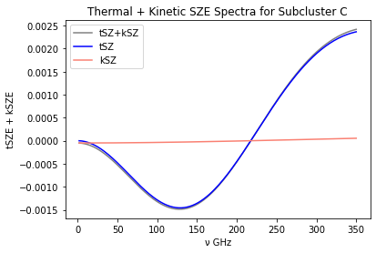

# Sunyaev-Zeldovich Effect
## Abstract:
The Cosmic Microwave Background (CMB) is the relic radiation from the Big Bang. CMB Photons travel through all of spacetime, carrying with them critical information of our universe. When CMB photons travel through galaxy clusters, they collide with high energy electrons, which give them an average energy boost. This causes a spectral distortion in the CMB, called the Sunyaev-Zel'dovich Effect (SZE). We examine the SZE and derive both the thermal and kinetic SZE and look at two analyses [4, 6] of the galaxy cluster MACS J0717.5+3745, a cluster formed by four separate galaxy subclusters. Using some of the data found in these analyses, we calculate the SZE distortions using equations derived in section 2 and explore benefits of these types of measurements.

## 1. Introduction:
The Cosmic Microwave Background (CMB) is an artifact from the origins of our universe. CMB radiation fills all of space and is the dominant radiation field in the universe [7]. This radiation carries with it critical information from the earliest moments of our universe. Thus, the CMB is of fundamental importance in the study of cosmology.

As CMB photons travel through the universe, they travel through galaxy clusters, a structure that consists of hundreds to thousands of galaxies all bound together by gravity [9]. These galaxy clusters are surrounded by hot gas filled with high energy electrons. When low energy CMB photons collide with these electrons, they are inverse Compton scattered, a process in which the CMB photons gain energy and the electrons lose energy [11]. This causes a small spectral distortion in the CMB spectrum, and is known as the Sunyaev-Zel'dovich Effect (SZE). The SZE provides us with a powerful tool for probing the universe and cosmology as a whole. SZE surveys can map the large scale structure (LSS) of the universe, which itself is a map of the primordial density fluctuations [2]. 

Maps of the LSS can give us information on the rate at which the universe is expanding, galaxy formation, dark matter distributions, and information about primordial density fluctuations [8]. 

The SZE has two different types: thermal SZE (tSZE) and kinetic SZE (kSZE). The tSZE is when the electrons that inverse Compton scatter the CMB photons have high energies due to their temperature, while the kSZE is a second-order effect where the electrons that interact with CMB photons have high energies due to their bulk motion.

## 2. Physical Processes
In this section, I will derive the spectrum distortion of both tSZE and kZSE. Most of this derivation can be found in [7].

Since the CMB is close to isotropic and characterized by a temperature $T_{CMB} \approx 2.7 K$, specific intensity of the CMB is given by the Bose-Einstein equilibrium formula:
<br>
<div style="text-align: center;">
<ol style="text-align: center; list-style-position: inside; padding: 0;">
<li>
  $I_{\nu} = \frac{2h\nu^3}{c^2}(e^{h\nu/k_BT_{CMB}}-1)^{-1}$
</li>
<br>
where $I_{max} \sim 3.7 \times 10^{-18} \frac{W}{m^2Hz sr}$ at $\nu_{max} \sim 160 GHz$, a photon density $n_{\gamma} \sim 4 \times 10^8 photons/m^3$, and mass density $\rho_{\gamma} \sim 5 \times 10^{-31} kg m^{-3}$.
<br>
<br>
When an electron scatters a photon, both the energy and direction of motion of both the electron and photon are altered. The change in properties of the photon can be described by the Compton scattering formula:
<br>
  <br>
<li>
  $\epsilon' = \frac{\epsilon}{1+\frac{\epsilon}{m_e c^2}(1-cos(\phi_{12}))}$
</li>
  <br>
where $\epsilon$ and $\epsilon'$ are the photon energies before and after the interaction, respectively, and $\phi_{12}$ is the angle at which the photon is deflected in the encounter.
<br>
  
For low energy photons and mildly to non-relativistic electrons, $\epsilon<<m_ec^2$ and the scattering is almost elastic ($\epsilon = \epsilon'$). This limit is applicable for the scatterings that occur in galaxy clusters that cause the SZE.
<br>

In this limit, the interaction cross section for a CMB photon with an electron can be described by the classical Thomson cross-section formula, which results in the limit $\epsilon' \rightarrow \epsilon$ <br>
<br>
<figure style="text-align: center;">

<figcaption><p style="text-align: center;"><b>Figure 1:</b> Scattering geometry in the rest frame of the electron before the interaction [7]</p></figcaption>
</figure>
<br>
<br>
If the geometry of the collision process in the electron rest frame is as shown in Figure 1, then the probability of a scattering with angle $\theta$ is <br>
  <br>
<li>
  $p(\theta)d\theta = p(\mu)d\mu=(2\gamma^4(1-\beta\mu)^3)^{-1}d\mu$
</li>

<br>
where the electron velocity $v_e = \beta c$ and $\mu = cos\theta$. <br>

The probability of a scattering to angle $\theta'$ is:<br>
<li>
  $\phi(\mu';\mu)d\mu'=\frac{3}{8}(1+\mu^2\mu'^2+\frac{1}{2}(1-\mu^2)(1-\mu'^2))d\mu'$
</li>
<br>
the change of photon direction causes the frequency of the scattered photon to be <br>
<br>
<li>
  $\nu''=\nu(1+\beta\mu')(1-\beta\mu)^{-1}$
</li>
<br>
with $\mu' = cos\theta'$. <br>
<br>
It is conventional to express the resulting scattering in terms of the logarithmic frequency shift caused by scattering, <br>
<li>
  $s = log(\nu/\nu'')$
</li>
<br>
where the probability that a single scattering of the photon causes a frequency shift $s$ from an electron with speed $\beta c$ is: <br>

<li>
  $P(s;\beta)ds = \int p(\mu) d\mu \phi(\mu';\mu) (\frac{d\mu'}{ds}) ds$
</li>
<br>
using equations (3-5), we can re-write this as <br>
<li>
  $P(s; \beta) = \frac{3}{16\gamma^{4}\beta} \int_{\mu_{1}}^{\mu_{2}}(1 + \beta\mu')(1+\mu^{2}\mu'^{2} + \frac{1}{2}(1-\mu^{2})(1-\mu'^{2}))(1-\beta\mu)^{-3}d\mu$
</li>
<br>
where, using equations 5 and 6, $\mu$ can be expressed in terms of $\mu$ and $s$ as <br>
<br>

<li>
  $\mu' = \frac{e^{s}(1-\beta \mu) -1}{\beta}$
</li>
<br>
since the integral is performed only over real angles, we have <br>
<br>

<li>
  ```
  \mu_1 = \begin{cases}
-1 & \text{if } s \leq 0 \\
\frac{1-e^{-s(1+\beta)}}{\beta} & \text{if } s \geq 0
\end{cases}
  ```
</li>


<li>
$$\mu_1 = \begin{cases} -1 & \text{if } s \leq 0 \\ \frac{1-e^{-s(1+\beta)}}{\beta} & \text{if } s \geq 0 \end{cases}$$
</li>
<li>
$$\mu_2 = \begin{cases} -1 & \text{if } s \leq 0 \ \frac{1-e^{-s(1-\beta)}}{\beta} & \text{if } s \geq 0 \end{cases}$$
</li>
<br>

The width of the function to zero intensity in $s$, <br>

<li>
  $\Delta s_0 = 2log(\frac{1+\beta}{1-\beta})$
</li>
<br>
increases because increasing $\beta$ causes the frequency shift related to a given photon angular deflection to increase. <br>

The distribution of photon frequency shifts caused by scattering by a population of electrons is calculated from $P(s;\beta)$ by averaging over the electron ($\beta$) distribution. <br>

For photons that have been scattered once, the probability distribution of $s$, $P_{1}(s)$ is given by <br>

<li>
  $P_{1}(s) = \int_{\beta_{lim}}^{1} p_{e}(\beta)d\beta P(s; \beta)$
</li>
<br>
where $\beta_{lim}$ is the minimum value of $\beta$ capable of causing a frequency shift $s$, <br>

<li>
  $\beta_{lim}= \frac{e^{|s|}-1}{e^{|s|}+1}$
</li>
<br>
The assumptions we made to derive the probability that a single scattering of the photon will cause a frequency shift $s$, equation (8), put limitations on equation (13). However, CMB photons satisfy these assumptions provided that $\gamma \lessapprox 2 \times 10^{9}$. In galaxy clusters, the typical electron temperatures can be as much as $1.8 \times 10^{8} K$ (15 keV), but the corresponding Lorentz factors are still small, so we can ignore relativistic corrections to the scattering cross-section. <br>

If the electron velocities are assumed to follow a relativistic Maxwellian distribution, <br>

<li>
  $p_{e}(\beta)d\beta = \frac{\gamma^{5}\beta^{2}exp(-\frac{\gamma}{\Theta})d\beta}{\Theta K_{2}(\frac{1}{\Theta})}$
</li>
<br>
where <br>
<br>
<li>
  $\Theta = \frac{k_{B}T_{e}}{m_{e}c^{2}}$
</li>
<br>
and $K_{2}(z)$ is a modified Bessel function of the second kind and second order, then the resulting distribution of photon frequency shift factors can be calculated by a numerical integration of equation (13). <br>

It is also useful to calculate the form of $P_{1}(s)$ for a power-law distribution of electron energies since electrons of this type can be found in the lobes of radio galaxies, and they can also produce a SZE. <br>

The power-law distribution of energies is given by: <br>

<li>
  $p_e(\gamma) d\gamma = {A \gamma^{-\alpha} d\gamma if \gamma_1 \leq \gamma \leq \gamma_2, 0 otherwise}$
</li>
<br>
where A is the normalizing constant

<li>
  $A = {\log(\gamma_2) - \log(\gamma_1) if \alpha = 1, ((1-\alpha)(\gamma_2^{1-\alpha} - \gamma_1^{1-\alpha}))^{-1} if \alpha \neq 1}$
</li>
<br>

Now, we can use the result for the frequency shift in a single scattering to calculate the form of the scattered spectrum of the CMB. The incident CMB spectrum is:

<li>
  $I_{0}(\nu) = \frac{2h\nu^{3}}{c^{2}}(e^{h\nu / k_{B}T_{CMB}}-1)^{-1}$
</li>
<br>
Now, if every photon in the incident CMB spectrum is scattered once, then the resulting spectrum is:

<li>
  $\frac{I(\nu)}{\nu} = \int_{0}^{\infty} d\nu_{0}P_{1}(\nu,\nu_0) \frac{I_{0}(\nu_{0})}{\nu_{0}}$
</li>
<br>
where $P_{1}(\nu, \nu_{0}) = P_{1}(s)/\nu$ is the probability that a scattering occurs from frequency $\nu$ to $\nu_{0}$, and $I(\nu)/h\nu$ is the spectrum in photon number terms.

Since $P_{1}(s)$ is the frequency shift function, the scattered CMB spectrum can be rewritten as a convolution in $s = ln(\nu / \nu_{0})$:

<li>
  $I(\nu) = \int_{-\infty}^{\infty} P_{1}(s)I_{0}(\nu_{0})ds$
</li>
<br>
Thus, the change in the CMB spectrum at frequency $\nu$ is then

<li>
  $\Delta I(\nu) = I(\nu) - I_{0}(\nu) = \frac{2h}{c^2}\int_{-\infty}^{\infty}P_1(s)ds(\frac{\nu_{0}^{3}}{e^{h\nu_0/k_BT_{rad}} -1} - \frac{\nu^{3}}{e^{h\nu/k_BT_{rad}} -1})$
</li>
<br>
The above integral is performed using the $P_1(s)$ appropriate for the spectrum of the scattering electrons.

However, a photon entering an electron distribution may be scattered many times through encounters with electrons. Thus, if the optical depth of the scattering through the electron cloud is $\tau_e$, then the probability that a photon penetrates the cloud unscattered is $e^{-\tau_e}$, the probability that it is once scattered is $\tau_e e^{\tau_e}$, and the probability of N scatterings is

<li>
  $p_N = \frac{\tau_{e}^{N}e^{-\tau_e}}{N!}$
</li>
<br>
and the full frequency re-distribution function from scattering is

<li>
  $P(s) = e^{-\tau_e}(\delta(s) + \tau_eP_1(s) + \frac{1}{2!}\tau_{e}^{2}P_2(s) + \cdots)$
</li>
<br>
The re-distribution function $P_n(s)$ after $n$ scatterings is 
<li>
$P_2(s) = \int dt_1 P_1(t_1) P_1(s-t_1)$
</li>
<li>
$P_3(s) = \int dt_1 dt_2 P_1(t_2) P_1(s-t_1-t_2)$
</li>
<li>
$\vdots$
</li>
<br>

Which can be written using Fourier Transforms, with $P_1(s)$ obtained by the back transform

<li>
  $P(s) = \frac{1}{\sqrt{2\pi}} \int_{-\infty}^{\infty} \tilde{P}(k)e^{iks}ds$
</li>
<br>
of
<li>
  $\tilde{P}(k) = e^{-\tau_e(\tilde{P_1}(k)-1)}$
</li>
<br>
where the Fourier Transform of $P_1(s)$ is 

<li>
  $\tilde{P}(k) = \frac{1}{\sqrt{2\pi}} \int_{-\infty}^{\infty} P_1(s)e^{iks}ds$
</li>
<br>
Then, the generalization of equation (21) is

<li>
  $I(\nu) = \int_{-\infty}^{\infty} P(s)I_0(\nu_0)ds$
</li>
<br>
However, the electron scattering medium is optically thin in most situations, with $\tau_e << 1$, so the approximation

<li>
  $P(s) = (1-\tau_e)\delta(s)+\tau_eP_1(s)$
</li>
<br>
is sufficient.

The resulting intensity change is given as 

<li>
  $\Delta I(\nu) = \frac{2h}{c^2}\tau_e\int_{\infty}^{\infty}P_1(s)ds(\frac{\nu_{0}^{3}}{e^{h\nu_0/k_BT_{rad}} -1} - \frac{\nu^{3}}{e^{h\nu/k_BT_{rad}} -1})$
</li>
<br>
Where we see that the intensity change by the SZE depends only on intrinsic properties of the scattering medium and is thus redshift-independent. The calculations that lead to (33) take into account the relativistic kinematics and statistics of the scattering process.


However, in the non-relativistic limit, the scattering process simplifies and can be described by the Kompaneets equation, which describes the change in the occupation number, $n(\nu)$, by a diffusion process:

<li>
  $\frac{\partial n}{\partial y} = \frac{1}{x_{e}^{2}} \frac{\partial}{\partial x_e} x_{e}^{4}(\frac{\partial n}{\partial x_e} + n + n^2)$
</li>
<br>
where $x_e = \frac{h\nu}{k_BT_e}$

and

<li>
  $y = \frac{k_BT_ect}{m_ec^2\lambda_e}$
</li>
<br>
is a dimensionless measure of time spent in the electron distribution, known as the Compton-y parameter. $\lambda_e$ is the Compton range, or the scattering mean free path $(n_e\sigma_T)^{-1}$. For a radiation field traveling through a cloud of electrons, $y$, the Compton-y parameter, can be re-written as 

<li>
  $y = \int n_e\sigma_Tdl \frac{k_BT_e}{m_ec^2}$
</li>
<br>
where the solution of (34) is $n = (e^{x_e}-1)^{-1}$ and the more general Bose-Einstein distributions $n = (e^{x_e + \alpha}-1)^{-1}$ are also solutions.

For the CMB and hot electrons, $x_e << 1$, so $\frac{\partial n}{\partial x_e}>>n,n^2$ and (34) becomes

<li>
  $\frac{\partial n}{\partial y} = \frac{1}{x_{e}^{2}} \frac{\partial}{\partial x_e} x_{e}^{4}(\frac{\partial n}{\partial x_e})$
</li>
<br>
At low temperatures and optical depth, when the Compton-y parameter is small, we can use the approximation $\frac{\partial n}{\partial y} = \frac{\Delta n}{y}$ in (37). Using this, and inserting the solution $n = (e^x-1)^{-1}$, we obtain:

<li>
  $\Delta n = xy \frac{e^x}{(e^x-1)^{2}}(x\coth(x/2)-4)$
</li>
<br>
with a corresponding $\Delta I(x) = x^3\Delta n(x)I_0$ where $I_0 = \frac{2h}{c^2}(\frac{k_BT_{CMB}}{h})^{3}$. Since $x\coth{x/2}-4 = \frac{(e^x+1)x-4(e^x-1)}{e^x-1} = \frac{x(e^x+1)}{e^x-1} -4$, we can write $\Delta I_{\nu}$ as

<li>
  $\Delta I_{\nu} = I_0y \frac{x^4e^x}{(e^x-1)^2}(x\frac{e^x+1}{e^x-1}-4)$
</li>
<br>
where $x = h\nu /k_BT_{CMB}$. This is the scattered spectrum of the CMB. From this, we can see that the classical frequency dependence of the tSZE is given by [6].

<li>
  $f(x, T_e) = x\frac{e^x+1}{e^x-1}-4$
</li>
<br>
and similarly, the spectral dependence of the kSZE, which follows that of the CMB in the non-relativistic regime, is

<li>
  $g(x, v_z, T_e) = \frac{x^4e^x}{(e^x-1)^2}$
</li>
<br>
The amplitude of the tSZ and kSZ are given by

<li>
  $y_{tSZ} = \frac{\sigma_T}{m_ec^2}\int P_e dl \equiv \frac{k_BT_e\tau}{m_ec^2}$
</li>
<br>
and

<li>
  $y_{kSZ} = \sigma_T\int \frac{-v_z}{c}n_e dl \equiv \frac{-v_z \tau}{c}$
</li>
<br>
respectively. $v_z$ is the line-of-sight velocity of the object you are measuring.

The tSZ spectrum for T = 5, 15 keV and $\tau = 10^{-2}$ looks like: 

<h2 style="text-align: center;"> **Figure 2:** tSZ spectrum </h2>


The kSZ spectrum for various line-of-sight velocities looks like:

<h2 style="text-align: center;"> **Figure 3:** kSZ spectrum </h2>


Clearly, both of these distortions are very small (notice the values of the y-axis). However, the tSZ causes a larger distortion than the kSZ, making it far more difficult to detect the kSZ. As we will discover below, the best way to measure the kSZ seems to be through multi-wavelength studies. Multi-wavelength studies use data taken from instruments that observe in different wavelengths to constrain various parameters and thus obtain a more accurate picture of the physics of LSS in the Universe. 
 
## 3. Measurements from the Literature

I focus on two publications [4, 6] which present on the galaxy cluster MACS J0717.5+3745, a triple-merger system with four distinct subclusters. [4] use 90 GHz SZE data from the MUltiplexed SQUID/TES Array at Ninety GHz (MUSTANG) bolometer array on the Green Bank Telescope, as well as 140 GHz and 268 GHz SZE data from the Bolocam instrument on the Caltech Submillimeter Observatory. They compared this data to a two-dimensional pressure map from Chandra X-ray observations. With the X-ray spectroscopic temperature constraints and  flux densities from their model fits, the authors fit a thermal and kinetic SZE spectrum to their Bolocam data to further constrain the line-of-sight velocity to the subcluster with a high velocity. They found that this subcluster has a line-of-sight proper velocity $v_z = 3600 \si{\kilogram\per\second}$, which agrees with optical velocity estimates for the subcluster. [4] also reported the first indication of the presence of a kSZ signal within MACS J0717.5+3745. [6] use 150 and 260 GHz data from the New IRAM KID Arrays (NIKA) camera at the Institut de Radio Astronomie Millimetrique 30m telescope, combine with X-ray observations from XMM-Newton, to constrain the line-of-sight velocities of each subcluster. They also extracted, for the first time, a resolved map of the kSZ signal in this galaxy cluster.

## 4. Calculations
With data found in Table 3 of [4], which includes X-ray temperature and inferred peculiar velocities of two of the subclusters, subclusters B and C, I calculate the kSZ and tSZ contributions to each of the subclusters spectra, as well as the total distortion due to both SZ effects. 

Table 3 in [4] gives the following values for subcluster B:

<li>
  $k_BT_e = 13.7 keV$
</li>
<li>
  $v_z(model) = 3600 \si{\kilogram\per\second}$
</li>
<li>
  $v_z(measured) = 4640 \si{\kilogram\per\second}$
</li>
<br>
and the following values for subcluster C:

<li>
  $k_BT_e = 24.1 keV$
</li>
<li>
  $v_z(model) = -3720 \si{\kilogram\per\second}$
</li>
<li>
  $v_z(measured) = -4120 \si{\kilogram\per\second}$
</li>
<br>
Using these values, I wrote functions in python using my the derived expressions above (40-43) and plotted the spectrum. 

\begin{figure}[h]
    \centering
    \subfloat[\centering Subcluster B]{{\includegraphics[width=8cm]{./images/subclusterB.png} }}%
    \qquad
    \subfloat[\centering Subcluster C]{{\includegraphics[width=8cm]{./images/subclusterC.png} }}%
    \caption{<b>Figure 4:</b>tSZE + kSZE for subclusters B and C}%
    \label{fig:example}%
\end{figure}
\FloatBarrier

The kSZ contributions in Figure 4 somewhat match what [4] obtained, since in (a), the kSZ contribution is trending downwards and in (b) it is trending upwards. However, [4] shows that for subcluster B, the kSZ contribution does trend downwards, but then it goes up slightly, and for subcluster C, it trends upwards but then goes down slightly, neither of which is shown in my plots. The tSZ contributions and $I(\nu)$ match the general shape of those in the respective analysis. 

Here is the corresponding figure in [4]:

\begin{figure}[h]
\!<b>Figure 5:</b> upper left: spectral sum of tSZE and kSZE flux densities for subcluster B, using measurments obtained from Bolocam. The best fit combined SZE is plotted as a solid blue line, with errors displayed as the cyan region. The kSZE contribution for best fit velocity is plotted in magenta. A pure tSZE spectrum to the data is plotted in red. Upper right: same as upper left, but using the directly measured flux density. Lower left: same as upper left, but for subcluster C. Lower right: same as upper right, but for subcluster C.
\centering
\includegraphics[width=0.7\textwidth]{./images/tony_fig.png}
\end{figure}

\FloatBarrier

[6] gives X-ray spectroscopic temperatures of the four subclusters:

<li>
  $A = 7.71 keV$
</li>
<li>
  $B = 11.22 keV$
</li>
<li>
  $C = 18.09 keV$
</li>
<li>
  $D = 13.56 keV$
</li>
</div>
</ol>
<br>
With these values, along with the spectroscopically determined line-of-sight velocities listed in [4], I found:

<table>
    <tr>
        <td>
            
        </td>
        <td>
            
        </td>
    </tr>
    <tr>
        <td>
            
        </td>
        <td>
            
        </td>
    </tr>
  <figcaption> <b>Figure 6:</b> tSZE + kSZE for subclusters A, B, C, and D.</figcaption>
</table>

For Figure 6, my plots generally do not match those in [6]. The overall shape of the tSZ and the tSZ + kSZ contributions are the same, but my kSZ contributions, specifically in (b), do not match. Of course, I do not have the data that either of these publications measured, so I do not expect my plots to match exactly. My plots do however give a very general overview of what one could expect to see from similar data taken of MACS J0717. 

Here is the corresponding figure in [6]:

<h2 style="text-align: center;"><b>Figure 7:</b>The black data points provide the average brightness measured by NIKA in the 22 arcsec radius regions. Possible point source residuals were masked when computing the average surface brightness. [6] </h2>


## 5. Results and Discussion

We see that the kSZ contributions in both of my figures do not match those in the respective analyses. This is of course because I have almost none of the data that the authors of the analyses did. The only data I used was X-ray spectroscopic temperatures and spectroscopically determined velocities, which was only one part of each of these analyses. Nonetheless, I was able to produce similar spectral lines. This is because the spectral distortion that the tSZ causes is very small, and that of the kSZ is even smaller. [4] was the first to indicate that MACS J0717.5 had kSZ contributions, and many years later, [6] was able to build on to this work by deriving a velocity map of the kSZ in the triple-merger. We see that a multi-frequency approach, especially with the rise in instrumental sensitivity, is the best way to measure these tiny distortions on the CMB. These measurements provide insight into the physics of mergers, which is extremely important in understanding how LSS forms in the Universe.   

## References:
1. Sunyaev, R. A., & Zeldovich, I. B. (1980). Microwave background radiation as a probe of the contemporary structure and history of the universe. Annual Review of Astronomy and Astrophysics, 18, 537-560. doi: 10.1146/annurev.aa.18.090180.002541
2. Carlstrom, J. E., Holder, G. P., & Reese, E. D. (2002). Cosmology with the Sunyaev-Zel’dovich Effect. Annual Review of Astronomy and Astrophysics, 40(1), 643-680. doi: 10.1146/annurev.astro.40.060401.093803
3. Orlowski-Scherer, J., Haridas, S. K., Di Mascolo, L., Perez Sarmiento, K., Romero, C. E., Dicker, S., ... & Sunyaev, R. (2022). GBT/MUSTANG-2 9'' resolution imaging of the SZ effect in MS0735.6+7421: Confirmation of the SZ Cavities through direct imaging. arXiv preprint arXiv:2207.07100.
4. Mroczkowski, T., Dicker, S., Sayers, J., Reese, E. D., Mason, B., Czakon, N., ... & Zemcov, M. (2012). A Multi-wavelength Study of the Sunyaev-Zel'dovich Effect in the Triple-merger Cluster MACS J0717.5+3745 with MUSTANG and Bolocam. The Astrophysical Journal, 761(1), 47.
5. Jauzac, M., Eckert, D., Schaller, M., Schwinn, J., Massey, R., Bahé, Y., ... & Zemcov, M. (2018). Growing a 'cosmic beast': observations and simulations of MACS J0717.5+3745. Monthly Notices of the Royal Astronomical Society, 481(3), 2901-2917.
6. Adam, R., Bartalucci, I., Pratt, G. W., Ade, P., André, P., Arnaud, M., ... & Zemcov, M. (2017). Mapping the kinetic Sunyaev-Zel'dovich effect toward MACS J0717.5+3745 with NIKA. Astronomy & Astrophysics, 598, A115.
7. Birkinshaw, M. (1999). The sunyaev–zel'dovich effect. Physics Reports, 310(2-3), 97–195.
8. Center for Astrophysics. (2021). Large scale structure. Retrieved from https://www.cfa.harvard.edu/research/topic/large-scale-structure
9. Wikipedia contributors. (2022). Sunyaev–Zeldovich effect. In Wikipedia, The Free Encyclopedia. Retrieved from https://en.wikipedia.org/wiki/Sunyaev%E2%80%93Zeldovich_effect
10. Mroczkowski, T., Nagai, D., Basu, K., Chluba, J., Sayers, J., Adam, R., ... & ZuHone, J. (2019). Astrophysics with the Spatially and Spectrally Resolved Sunyaev-Zeldovich Effects. A Millimetre/Submillimetre Probe of the Warm and Hot Universe. Space Science Reviews, 215(1), 17.
11. Longair, M. S. (2011). High energy astrophysics. Cambridge University Press.
